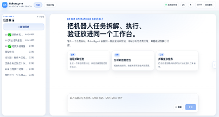
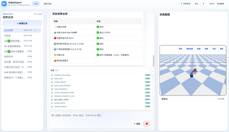
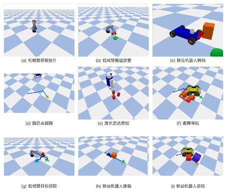

# RobotAgent

[English](README.en.md) | 简体中文

一个面向机器人任务执行的多 Agent 平台，集成聊天交互、子代理协作、MCP 仿真控制、Agentic RAG 与实时可视化界面。

## 界面预览







## 项目概览

RobotAgent 提供一套围绕机器人任务的端到端工作流：

- 后端使用 FastAPI 提供认证、会话管理、流式聊天和仿真帧接口
- 主代理负责任务理解、工具调用和子代理调度
- 子代理负责仿真执行和数据分析
- 仿真能力通过 MCP 接入 PyBullet 与 Gazebo
- 前端基于 Vue 3 + Vite，支持聊天、计划面板、工具结果和仿真画面展示
- RAG 模块用于学术/技术资料检索与本地知识库查询

当前仓库的模型、MCP 地址和外部服务密钥通过 [config/config.yml](config/config.yml) 配置，不应在 README 中写死为某个固定模型或部署方式。

## 目录结构

下面只列出与项目运行直接相关的主要目录：

```text
robotagent/
├── backend/                 # FastAPI 应用、认证、会话、流式聊天、仿真接口
├── frontend/                # Vue 3 前端
├── tools/                   # 主代理工具与分析工具
├── prompts/                 # 主代理 / 分析代理 / 仿真代理提示词
├── mcp/                     # MCP 服务与仿真资源
├── RAG/                     # 检索与建库脚本
├── training_free_grpo/      # 经验采集与训练自由优化相关脚本
├── tests/                   # 单元测试
├── config/config.yml        # 模型、MCP 与外部服务配置
├── server.py                # Uvicorn 启动入口
├── dev.sh                   # 同时启动前后端的开发脚本
└── requirements.txt         # Python 依赖
```

说明：

- 根目录还包含论文文档、答辩材料、输出文件和临时资源，这些不属于项目运行所必需的代码结构
- 前端依赖定义在 [frontend/package.json](frontend/package.json)，不是根目录 [package.json](package.json)

## 核心能力

- 多 Agent 协作：主代理 + `data-analyzer` + `simulator`
- 流式聊天：`/api/chat/send` 以 NDJSON 返回增量消息
- 会话管理：基于 Redis 保存聊天记录、会话索引和登录状态
- 实时仿真画面：通过 `/api/sim/stream` 和 `/api/sim/latest.png` 回传
- 工具化检索：支持 workspace 搜索、网页搜索、学术搜索与本地 RAG
- 分析工具：支持 CSV 摘要、统计描述和图表生成

## 技术栈

- 后端：FastAPI、LangChain、LangGraph、Redis
- 前端：Vue 3、Vite、Markdown-It、KaTeX、highlight.js
- 仿真：PyBullet MCP、Gazebo MCP
- 检索：Qdrant、sentence-transformers、Tavily、arXiv/OpenAlex

## 环境要求

- Python 3.10+
- Node.js 18+
- Redis 6+
- 可用的 OpenAI-compatible LLM 服务
- 可选：Docker，用于启动 PyBullet / Gazebo / Qdrant

## 安装

### 1. 安装 Python 依赖

推荐使用仓库已有的 `.venv` 环境：

```bash
rtk .venv/bin/python -m pip install -r requirements.txt
```

如果不使用 `rtk`，也可以在自己的虚拟环境中运行：

```bash
pip install -r requirements.txt
```

### 2. 安装前端依赖

```bash
cd frontend
npm install
```

## 配置

主要配置文件是 [config/config.yml](config/config.yml)。

需要重点检查：

- `llm` / `model_url`：主代理模型与推理服务地址
- `analysis_llm` / `simulation_llm`：子代理模型配置
- `mcp`：PyBullet / Gazebo MCP 地址
- `tavily.api_key`：网页搜索
- `judge`：实验评估使用的外部裁判模型

建议：

- 将实际密钥改为你自己的配置
- 不要把真实 API key 提交到公开仓库

Redis 默认使用以下 DB：

- `redis://127.0.0.1:6379/0`：LangGraph checkpoint
- `redis://127.0.0.1:6379/1`：聊天记录
- `redis://127.0.0.1:6379/2`：认证与会话

## 启动方式

### 启动后端

```bash
rtk .venv/bin/python server.py
```

默认监听：`http://127.0.0.1:8000`

### 启动前端

```bash
cd frontend
rtk npm run dev
```

默认监听：`http://127.0.0.1:5173`

### 一键启动前后端

```bash
./dev.sh
```

[dev.sh](dev.sh) 会在启动前清理 `8000` 和 `5173` 端口上的已有进程，并同时拉起后端与前端。可以通过 `BACKEND_PYTHON=/path/to/python ./dev.sh` 指定后端 Python 解释器。

### Redis

Redis 是必需的后端依赖，用于会话管理与 Agent checkpoint。

```bash
# macOS/Linux 本地安装后直接启动
redis-server --daemonize yes

# 或使用 Docker
docker run -d --name robotagent-redis -p 6379:6379 redis:7
```

验证 Redis 正常运行：

```bash
redis-cli ping
# 应返回：PONG
```

## 仿真服务

### PyBullet / Gazebo MCP

可以直接运行 Python 服务，也可以使用 Docker Compose。

```bash
# Python 方式
rtk .venv/bin/python mcp/mcp_server.py
rtk .venv/bin/python mcp/gazebo_mcp_server.py
```

```bash
# Docker 方式
docker compose -f docker/pybullet/docker-compose.yml up -d --build
docker compose -f docker/gazebo/docker-compose.yml up -d --build
```

当前代码里：

- 后端健康检查默认探测 PyBullet 端口 `18001`
- 后端健康检查默认探测 Gazebo 端口 `8002`
- 子代理会从 [config/config.yml](config/config.yml) 的 `mcp` 配置解析服务地址

### Qdrant

如果要启用本地知识库检索，需要准备 Qdrant：

```bash
docker compose -f docker/qdrant/docker-compose.yml up -d
```

默认端口为 `6333`。

## API 概览

### 系统

- `GET /api/health`
- `GET /api/ping`
- `GET /api/tools`

### 认证

- `POST /api/auth/register`
- `POST /api/auth/login`
- `GET /api/auth/me`
- `POST /api/auth/logout`

### 聊天与会话

- `GET /api/messages`
- `GET /api/sessions`
- `DELETE /api/sessions/{session_id}`
- `POST /api/chat/send`

### 仿真

- `GET /api/sim/debug`
- `GET /api/sim/latest-frame`
- `GET /api/sim/latest.png`
- `GET /api/sim/stream`

## 主要代码位置

- [backend/app.py](backend/app.py)：应用入口、Agent 初始化、聊天与会话 API
- [backend/routes_auth.py](backend/routes_auth.py)：注册、登录、鉴权
- [backend/routes_sim.py](backend/routes_sim.py)：仿真帧读取与 SSE 推送
- [agent-gateway/](agent-gateway/)：基于 Pi 的公共 Agent Gateway 与 OpenAI 兼容 API
- [tools/GeneralTool.py](tools/GeneralTool.py)：遗留可调用 workspace / web / academic / RAG 工具函数
- [tools/AnalysisTool.py](tools/AnalysisTool.py)：遗留可调用统计与图表工具函数
- [frontend/src/components/ChatView.vue](frontend/src/components/ChatView.vue)：主聊天界面
- [frontend/src/components/AboutView.vue](frontend/src/components/AboutView.vue)：系统说明页

## RAG 与实验脚本

仓库包含独立的 RAG 和实验脚本，但它们不是启动 Web 平台的必需前置条件。

常用入口：

```bash
rtk .venv/bin/python RAG/script/run_rag_pipeline.py
rtk .venv/bin/python training_free_grpo/collect.py
```

运行前需要根据脚本依赖自行准备对应服务与数据。

## 测试

```bash
rtk .venv/bin/pytest
```

现有测试主要覆盖工具与 MCP 交互相关模块。
