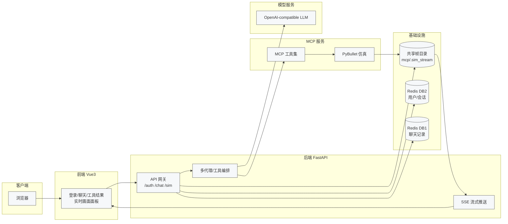

# 架构图（Mermaid）

```mermaid
flowchart LR
  subgraph Client[客户端]
    browser[浏览器]
  end

  subgraph Frontend[前端 Vue3]
    ui[登录/聊天/工具结果
实时画面面板]
  end

  subgraph Backend[后端 FastAPI]
    api[API 网关
/auth /chat /sim]
    agent[多代理/工具编排]
    stream[SSE 流式推送]
  end

  subgraph Infra[基础设施]
    redis_auth[(Redis DB2
用户/会话)]
    redis_chat[(Redis DB1
聊天记录)]
    sim_dir[(共享帧目录
mcp/.sim_stream)]
  end

  subgraph MCP[MCP 服务]
    pyb[PyBullet 仿真]
    tools[MCP 工具集]
  end

  subgraph Model[模型服务]
    llm[OpenAI-compatible LLM]
  end

  browser --> ui --> api
  api --> agent
  agent --> llm
  agent --> tools
  tools --> pyb --> sim_dir
  api --> sim_dir --> stream --> ui
  api --> redis_auth
  api --> redis_chat

  classDef box fill:#f6f8fa,stroke:#555,stroke-width:1px;
  class browser,ui,api,agent,stream,redis_auth,redis_chat,sim_dir,pyb,tools,llm box;
```
