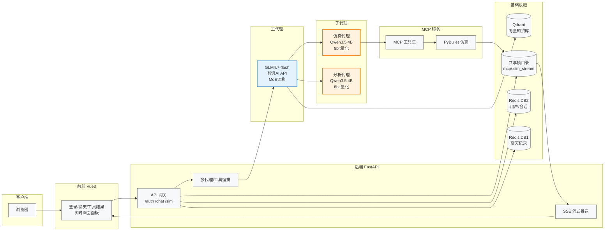

# 架构图（Mermaid）

```mermaid
flowchart LR
  subgraph Client[客户端]
    browser[浏览器]
  end

  subgraph Frontend[前端 Vue3]
    ui[登录/聊天/工具结果
实时画面面板]
  end

  subgraph Backend[后端 FastAPI]
    api[API 网关
/auth /chat /sim]
    agent[多代理/工具编排]
    stream[SSE 流式推送]
  end

  subgraph Infra[基础设施]
    redis_auth[(Redis DB2
用户/会话)]
    redis_chat[(Redis DB1
聊天记录)]
    qdrant[(Qdrant
向量知识库)]
    sim_dir[(共享帧目录
mcp/.sim_stream)]
  end

  subgraph MCP[MCP 服务]
    pyb[PyBullet 仿真]
    tools[MCP 工具集]
  end

  subgraph MainAgent[主代理]
    main_llm[GLM4.7-flash<br/>智谱AI API<br/>MoE架构]
  end

  subgraph SubAgents[子代理]
    sim_agent[仿真代理<br/>Qwen3.5 4B<br/>8bit量化]
    anal_agent[分析代理<br/>Qwen3.5 4B<br/>8bit量化]
  end

  browser --> ui --> api
  api --> agent
  agent --> main_llm
  main_llm --> sim_agent
  main_llm --> anal_agent
  sim_agent --> tools
  tools --> pyb --> sim_dir
  api --> sim_dir --> stream --> ui
  api --> redis_auth
  api --> redis_chat
  main_llm --> qdrant

  classDef box fill:#f6f8fa,stroke:#555,stroke-width:1px;
  classDef main fill:#e3f2fd,stroke:#1976d2,stroke-width:2px;
  classDef sub fill:#fff3e0,stroke:#f57c00,stroke-width:2px;
  class browser,ui,api,agent,stream,redis_auth,redis_chat,qdrant,sim_dir,pyb,tools box;
  class main_llm main;
  class sim_agent,anal_agent sub;
```
