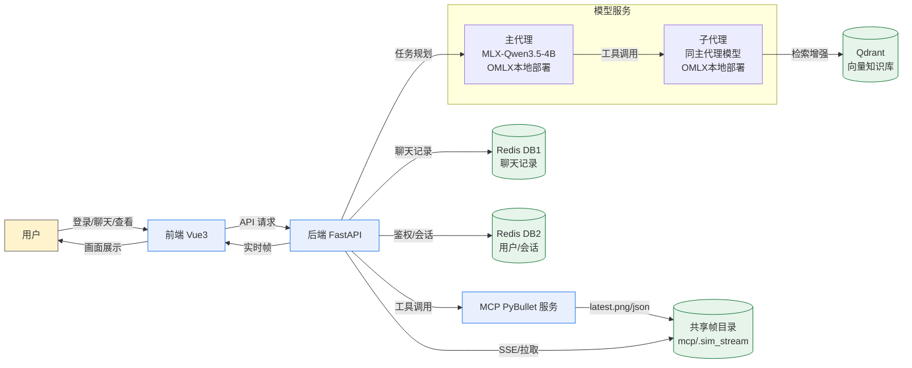

# 数据流图（Mermaid, Level 0）

```mermaid
flowchart LR
  user[用户]:::ext
  frontend[前端 Vue3]:::proc
  backend[后端 FastAPI]:::proc
  mcp[MCP PyBullet 服务]:::proc

  subgraph 模型服务
    main_agent[主代理<br/>MLX-Qwen3.5-4B<br/>OMLX本地部署]
    sub_agent[子代理<br/>同主代理模型<br/>OMLX本地部署]
  end

  redis_chat[(Redis DB1
聊天记录)]:::store
  redis_auth[(Redis DB2
用户/会话)]:::store
  qdrant[(Qdrant
向量知识库)]:::store
  sim_dir[(共享帧目录
mcp/.sim_stream)]:::store

  user -->|登录/聊天/查看| frontend
  frontend -->|API 请求| backend
  backend -->|鉴权/会话| redis_auth
  backend -->|聊天记录| redis_chat
  backend -->|任务规划| main_agent
  main_agent -->|工具调用| sub_agent
  sub_agent -->|检索增强| qdrant
  backend -->|工具调用| mcp
  mcp -->|latest.png/json| sim_dir
  backend -->|SSE/拉取| sim_dir
  backend -->|实时帧| frontend
  frontend -->|画面展示| user

  classDef ext fill:#fff3cd,stroke:#555,stroke-width:1px;
  classDef proc fill:#e8f0fe,stroke:#1a73e8,stroke-width:1px;
  classDef store fill:#e6f4ea,stroke:#137333,stroke-width:1px;
```
