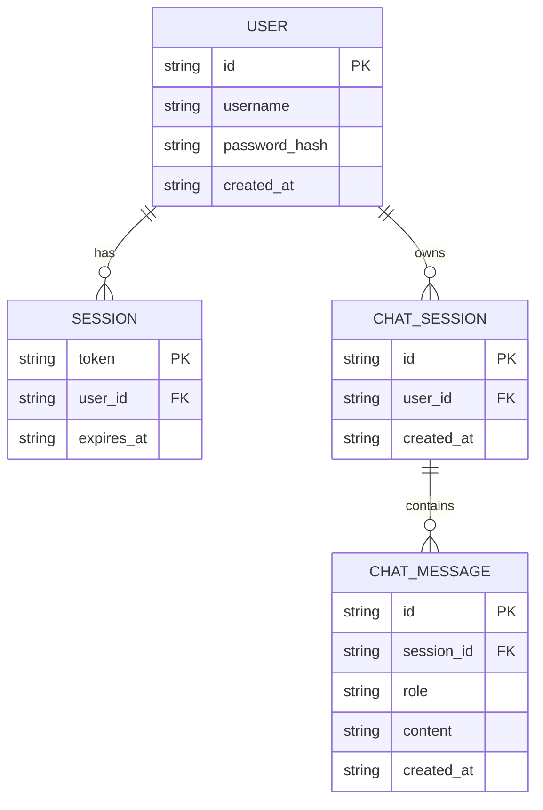

# ER 图（Mermaid）

```mermaid
erDiagram
  USER {
    string id PK
    string username
    string password_hash
    string created_at
  }

  SESSION {
    string token PK
    string user_id FK
    string expires_at
  }

  CHAT_SESSION {
    string id PK
    string user_id FK
    string created_at
  }

  CHAT_MESSAGE {
    string id PK
    string session_id FK
    string role
    string content
    string created_at
  }

  USER ||--o{ SESSION : has
  USER ||--o{ CHAT_SESSION : owns
  CHAT_SESSION ||--o{ CHAT_MESSAGE : contains
```

说明：后端使用 Redis 存储会话与聊天记录，这里用 ER 形式表达逻辑结构。
