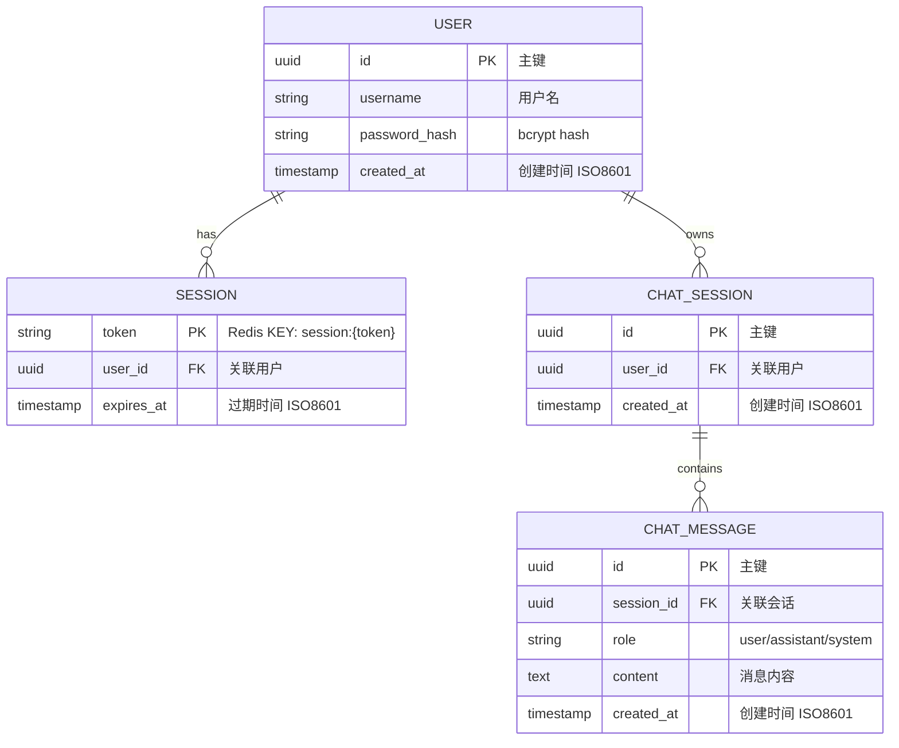

# ER 图（Mermaid）

%%{init: {'theme': 'base', 'themeVariables': {'primaryColor': '#E3EDF7', 'primaryTextColor': '#2C3E50', 'primaryBorderColor': '#5D7B9D', 'lineColor': '#5D7B9D', 'fontFamily': 'Arial', 'fontSize': '14px'}}}%%

说明：后端使用 Redis 存储会话与聊天记录，这里用 ER 形式表达逻辑结构。