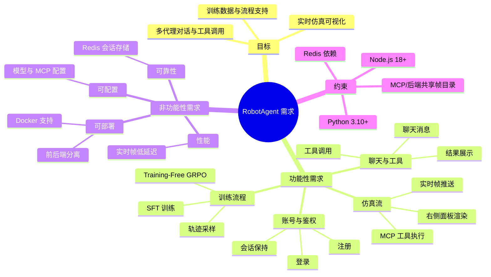

# 需求分析图（Mermaid）

```mermaid
mindmap
  root((RobotAgent 需求))
    目标
      多代理对话与工具调用
      实时仿真可视化
      训练数据与流程支持
    功能性需求
      账号与鉴权
        注册
        登录
        会话保持
      聊天与工具
        聊天消息
        工具调用
        结果展示
      仿真流
        MCP 工具执行
        实时帧推送
        右侧面板渲染
      训练流程
        SFT 训练
        轨迹采样
        Training-Free GRPO
    非功能性需求
      性能
        实时帧低延迟
      可靠性
        Redis 会话存储
      可配置
        模型与 MCP 配置
      可部署
        Docker 支持
        前后端分离
    约束
      Python 3.10+
      Node.js 18+
      Redis 依赖
      MCP/后端共享帧目录
```
