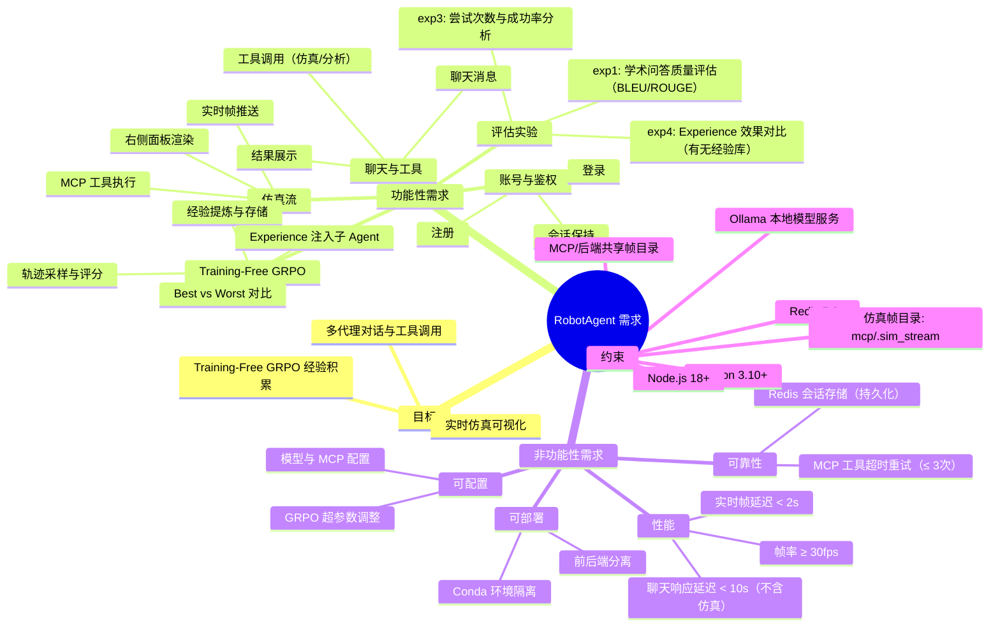

# 需求分析图（Mermaid）

%%{init: {'theme': 'base', 'themeVariables': {'primaryColor': '#E3EDF7', 'primaryTextColor': '#2C3E50', 'primaryBorderColor': '#5D7B9D', 'lineColor': '#5D7B9D', 'fontFamily': 'Arial', 'fontSize': '14px', 'clusterBkg': '#F5F7FA'}}}%%

