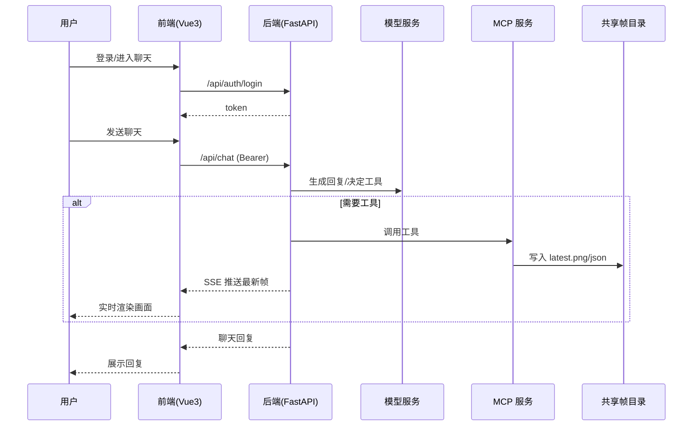

# 时序图（Mermaid）

```mermaid
sequenceDiagram
  participant U as 用户
  participant FE as 前端(Vue3)
  participant BE as 后端(FastAPI)
  participant LLM as 模型服务
  participant MCP as MCP 服务
  participant SIM as 共享帧目录

  U->>FE: 登录/进入聊天
  FE->>BE: /api/auth/login
  BE-->>FE: token

  U->>FE: 发送聊天
  FE->>BE: /api/chat (Bearer)
  BE->>LLM: 生成回复/决定工具
  alt 需要工具
    BE->>MCP: 调用工具
    MCP->>SIM: 写入 latest.png/json
    BE-->>FE: SSE 推送最新帧
    FE-->>U: 实时渲染画面
  end
  BE-->>FE: 聊天回复
  FE-->>U: 展示回复
```
