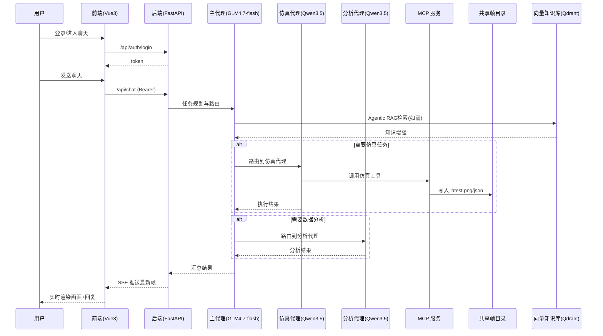

# 时序图（Mermaid）

```mermaid
sequenceDiagram
  participant U as 用户
  participant FE as 前端(Vue3)
  participant BE as 后端(FastAPI)
  participant Main as 主代理(GLM4.7-flash)
  participant Sim as 仿真代理(Qwen3.5)
  participant Anal as 分析代理(Qwen3.5)
  participant MCP as MCP 服务
  participant SIM as 共享帧目录
  participant RAG as 向量知识库(Qdrant)

  U->>FE: 登录/进入聊天
  FE->>BE: /api/auth/login
  BE-->>FE: token

  U->>FE: 发送聊天
  FE->>BE: /api/chat (Bearer)
  BE->>Main: 任务规划与路由
  Main->>RAG: Agentic RAG检索(如需)
  RAG-->>Main: 知识增强

  alt 需要仿真任务
    Main->>Sim: 路由到仿真代理
    Sim->>MCP: 调用仿真工具
    MCP->>SIM: 写入 latest.png/json
    Sim-->>Main: 执行结果
  end

  alt 需要数据分析
    Main->>Anal: 路由到分析代理
    Anal-->>Main: 分析结果
  end

  Main-->>BE: 汇总结果
  BE-->>FE: SSE 推送最新帧
  FE-->>U: 实时渲染画面+回复
```
