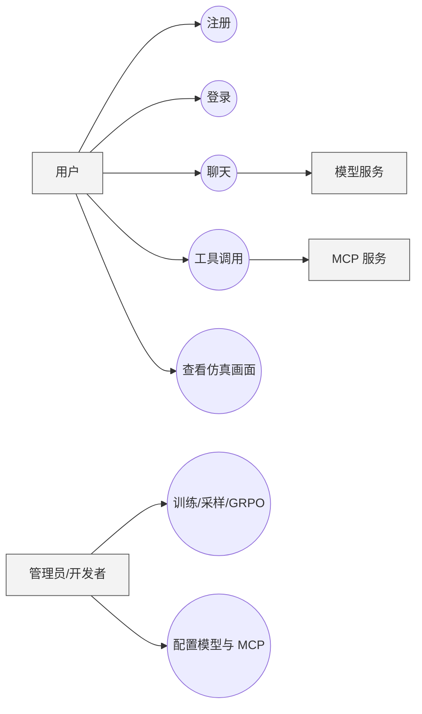

# 用例图（Mermaid）

```mermaid
flowchart LR
  user[用户]:::actor
  admin[管理员/开发者]:::actor
  mcp[MCP 服务]:::actor
  model[模型服务]:::actor

  uc_register((注册))
  uc_login((登录))
  uc_chat((聊天))
  uc_tool((工具调用))
  uc_stream((查看仿真画面))
  uc_train((训练/采样/GRPO))
  uc_config((配置模型与 MCP))

  user --> uc_register
  user --> uc_login
  user --> uc_chat
  user --> uc_tool
  user --> uc_stream

  admin --> uc_train
  admin --> uc_config

  uc_tool --> mcp
  uc_chat --> model

  classDef actor fill:#f3f3f3,stroke:#555,stroke-width:1px;
```
