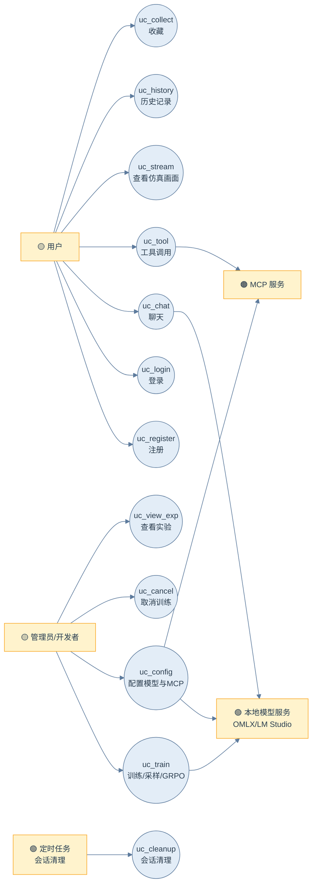

# 用例图（Mermaid）

```mermaid
%%{init: {'theme': 'base', 'themeVariables': {'primaryColor': '#E3EDF7', 'primaryTextColor': '#2C3E50', 'primaryBorderColor': '#5D7B9D', 'lineColor': '#5D7B9D', 'fontFamily': 'Arial', 'fontSize': '14px'}}}%%
flowchart LR
  user[🟡 用户]:::actor
  admin[🟡 管理员/开发者]:::actor
  mcp[🟠 MCP 服务]:::actor
  model[🟢 本地模型服务<br/>OMLX/LM Studio]:::actor
  schedule[🟢 定时任务<br/>会话清理]:::actor

  uc_register((uc_register<br/>注册))
  uc_login((uc_login<br/>登录))
  uc_chat((uc_chat<br/>聊天))
  uc_tool((uc_tool<br/>工具调用))
  uc_stream((uc_stream<br/>查看仿真画面))
  uc_history((uc_history<br/>历史记录))
  uc_collect((uc_collect<br/>收藏))
  uc_train((uc_train<br/>训练/采样/GRPO))
  uc_config((uc_config<br/>配置模型与MCP))
  uc_cancel((uc_cancel<br/>取消训练))
  uc_view_exp((uc_view_exp<br/>查看实验))
  uc_cleanup((uc_cleanup<br/>会话清理))

  user --> uc_register
  user --> uc_login
  user --> uc_chat
  user --> uc_tool
  user --> uc_stream
  user --> uc_history
  user --> uc_collect

  admin --> uc_train
  admin --> uc_config
  admin --> uc_cancel
  admin --> uc_view_exp

  schedule --> uc_cleanup

  uc_tool --> mcp
  uc_chat --> model
  uc_train --> model
  uc_config --> model
  uc_config --> mcp

  classDef actor fill:#FFF3CD, stroke:#F9A825, stroke-width:1px;
```
